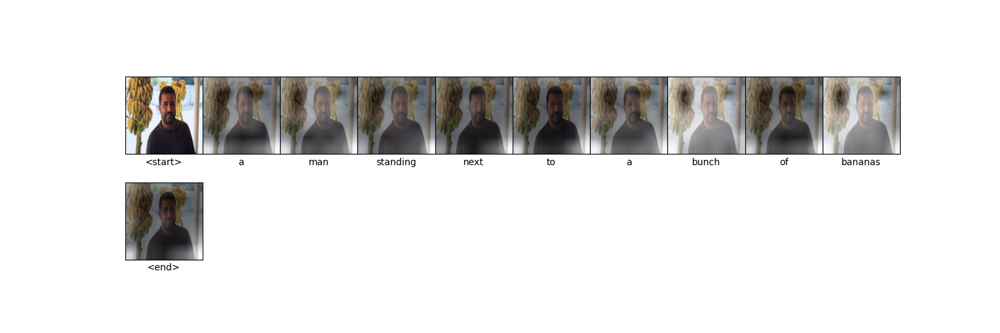

## Yet another implementation of spatial attention

Learning to dynamically weight features while generating an output is called attention,
and one of the more popular papers detailing attention is the paper [Show, Attend and
Tell](https://arxiv.org/abs/1502.03044). This repo implements spatial attention as defined
in the paper [Knowing When to Look](https://arxiv.org/abs/1612.01887) using pytorch.

### Data

Download '2014 Train Images', '2014 Val Images' and '2014 Train/Val annotations' from
https://cocodataset.org/#download. Unzip val2014.zip and train2014.zip into
data/original/images/. Then unzip captions_train-val2014.zip into
data/original/.

If you'd like to use GloVe embeddings, follow the [readme](./vocab/embedding/readme.md) in
vocab/embedding.

### Code

I tested this on a fresh git clone on Arch with Python 3.8 and got it to run, but there
might be systemwide dependencies I'm missing in these instructions.

First install the needed libraries and set PYTHONPATH
```bash
pip install -r requirements.txt
source set_pythonpath.bash
```
Then build the vocabulary and preprocess the images and captions downloaded previously
from the coco website.
```bash
python vocab/build_vocab.py
python preprocess.py
```
To train call
```bash
python train.py
```
Some options to pass into train.py include 'save\_step' that sets at what
batch the training model will save into directory 'save\_dir'. Validation metrics are
output every 'metric\_step' batches. nltk might require a download in order for the METEOR
evaluation code to run.

To view a generated caption after 5 epochs with the models having been saved to the
default directory call
```bash
python caption.py --loadfile=models/saved/4-0.pt
```
This generates a plot that crudely highlights visual features the model gave higher
weighting to while generating the output word.

### Observations

The below is an example of a generated caption aligned with attention weights.


After observing a few of these plots on a model that has stagnated in improvement, it
becomes apparent that not all words are visually grounded in the image. A natural
extension to spatial attention is adaptive attention, where the model can learn to
modulate its attention between the image and its LSTM cell memory. The paper [Knowing When
to Look](https://arxiv.org/abs/1612.01887) details this approach.
